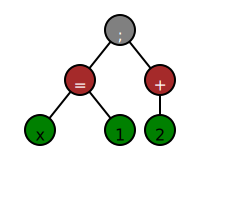

# 第1章 構文解析の世界へようこそ

皆さん、はじめまして！この本は「構文解析」というテーマについて扱った、一風変わった本です。これまで「構文解析」については、コンパイラや言語処理系を扱った書籍の一部で触れられる程度でした。「Parsing Techniques」という英語の書籍があるものの、英語圏ですら広く知られているとは言い難いですし、内容も網羅的ではあるものの平易とは言えません。

私がはじめて「構文解析」の入口に立ったのは高校三年生のときでした。当時、私はプログラミング言語に興味を持ち始め、いつかは自分のプログラミング言語を作ってみたいと思っていました。しかし、高校の図書館にあった「プログラミング言語を作る」本を借りて読んでみたももの、とても難しく当時の私には理解できませんでしたし、コンパイラ開発者のバイブルともよばれる「ドラゴンブック」[^1]も同様でした。

何がきっかけかは覚えていないのですが、いきなり大きな言語を作ろうとしても難しいということでまずは括弧を含む算術式を計算できる「電卓」アプリを作ることにしました。非常に単純なもので

```sh
(1 + 2) * (3 + 4) 
```

のようにテキストフィールドに入力して「計算」ボタンを押すと`21`と表示される、ただそれだけの代物です。今振り返れば、この電卓アプリはごく初歩的な「構文解析」と「インタプリタ」を実装したものとも言えます。

ただし、当時の私は言語処理系を作る際に必須の知識がほとんどなく、抽象構文木も典型的な構文解析のアルゴリズムも知らず、足りない知恵を振り絞って括弧の対応や演算子の優先順位を自力で計算したのでした。それは本当に拙いものでしたが、それでもなんとか動くものを作ることができたのです。

それから二十年余り。筆者は現在、研究職ではないものの構文解析の手法の一つである、Parsing Expression Grammar（PEG）を専門として、時折関連する論文の査読を引き受けたりしています。

現在の私は研究に未練を残しつつちょっとアカデミアに関わりがある微妙な立場ですが、そんな中でも折に触れて思うことがありました。構文解析はなぜ、一般の技術書であまり取り上げられないのだろうか、ということです。

言語処理系を扱う書籍の一部として構文解析が取り上げられることは珍しくありません。しかし、その扱いはあくまで「おまけ」であって、言語を作る上での通過点としてしか位置づけられていません。これについては、言語の本質は構文解析の「後」にあるのであり、構文は本質ではないというのが大きいでしょう。筆者もこの点に異論はありません。ただ、構文（正確には具象構文）はほんとうに「おまけ」なのでしょうか。ときどき疑問に思います。

プログラミング言語に携わる研究者の間では、プログラミング言語の「意味」は抽象構文木に対して定めされるものであり、構文は「ガワ」に過ぎないという考え方の人が多いように思いますし、その考えも間違ってはいないと思います。

しかし、現実に我々が読み書きするのはプログラムの抽象構文木ではなく、プログラムの文字列です。構文はUIであると言えます。多くのアプリケーションにおいてUIが果たす役割は非常に大きく、UI自体が専門分野として存在しているくらいです。そのUIたる構文とUIを適切な内部構造に変換する構文解析は軽視されていいのだろうか。筆者が構文解析の本を書こうと思い立ったのはそんな「こだわり」からでした。

本書の読者の皆さんには、構文解析の世界を少しでも楽しんでいただければと思います。構文解析は非常に奥深いテーマであり、その奥深さを一冊の本で完全に網羅することはできません。しかし、本書を通じて構文解析の基礎を学び、その面白さを感じていただければと思います。

たとえば、そもそも構文解析とは何でしょうか。実はこの問いだけをとっても答えは1つではありません。

入力文字列を引数にとって、文法に沿っているかどうかを真偽値として返す関数を構文解析とみなす考え方があります。このような場合、構文解析は以下のようなメソッドとして表現できます。

```java
boolean parse(String input);
```

入力文字列を引数にとって、文法に沿っているならば抽象構文木を、そうでなければエラーを返す関数を構文解析とみなす考え方もあります。この場合、構文解析はsealed interfaceとrecordを使って以下のようなメソッドとして表現できます。

```java
interface Tree {}
sealed interface ParseResult permits ParseResult.Success, ParseResult.Failure {
  record Success(Tree ast) implements ParseResult {}
  record Failure(String errorMessage) implements ParseResult {}
}
ParseResult parse(String input);
```

その他にも色々な考え方があります。非自然言語の構文解析というテーマは大きく扱われることが少ないですが、奥が深いものです。

皆さんがもっとも身近に使っている言語の1つであるJavaScriptを例にとって、この問題の奥深さについて説明してみます。

以下のJavaScriptプログラムを構文解析することにします。

```js
x = 1 +
  2
```

直観的には、以下のような抽象構文木が結果として返ってくるのが正しいように思われます（抽象構文木の説明は、いったんおいておきます）。


では、次のJavaScriptプログラムはどうでしょうか？

```
x = 1
+ 2
```

おそらく多くの方は先ほどと同じ構文木になることを期待するのではないでしょうか。

しかし、実際は以下のような結果になります。



`+`の後で改行するか後で改行するかという一見**ささいな違い**によって、構文解析の結果が変わってしまうのです。

2000年以降に登場して普及した言語は、このような特徴を持っていることが多いです。たとえば、Go、Swift、Kotlin、Scalaの文法はこのような特徴を持っています。

もっと古い言語でもRubyやPythonも同じ特徴を持っています。ちょっとした違いで構文解析結果が変わってしまう例は珍しくありません。

このような文法の進化の背景には、プログラマにとって「書きやすく読みやすい」文法を提供するという意図があります。このような「改行に敏感な」文法は構文解析の複雑さを増大させることになるため、プログラミング言語の設計者からすると面倒なことが増えるわけですが、ユーザーにとってはより簡単に感じられるため広く普及するに至ったのでしょう。

しかし「構文解析の複雑さを増大させる」というのは一体どういうことでしょうか。ほとんどの方はピンと来ないのではないでしょうか。この本では、このような問いに対して一定の答えを提示することを目指します。「目指す」というのはなんとも頼りない表現ですが、「構文解析の複雑さ」を定量的に評価するための枠組みがないため、どうしてもこのような表現になってしまいます。

読者の皆さんは既存の言語に歯がゆさを感じたことはないでしょうか。たとえば、昨今はJSONやYAMLを用いてDSL (Domain Specific Language)を提供することが一般的になっています。

しかし、これらのDSLはJSONやYAMLの枠に収めるために無理をしており、どうしても「不自然」な文法になってしまいます。JSONやYAMLは世界中に普及していますから、JSONやYAMLを使ったDSLを提供する合理性はあるもの、場合によってはJSONやYAMLに縛られないDSLの文法を考案することが求められることもあります。そのためには構文解析の知識が必要です。

構文解析は単に実用的であるにとどまらず非常に「楽しい」テーマです。読者の皆さんには本書を通じて、是非「構文解析の面白さ」を感じていただければと思います。

本書は次のような構成になっています。

第2章では簡単な算術式を例題にして、構文解析とはどういう処理かを体感してもらいます。定義を天下り式に提示するような本もありますが、構文解析については「まずは書いてみる」のが手っ取り早いというのが筆者の持論です。

第3章ではJSONの構文解析器を書いてもらいます。JSONは世界中で使われている非常に実用的なデータ形式（言語）でありながら、非常にシンプルです。そのシンプルなJSONを通して、実用的な言語の構文解析の基礎を学んでいただければと思います。

第4章では文脈自由文法（や言語）について解説します。文脈自由文法やそれに関する理論は構文解析の基礎になっています。括弧の対応を表現する言語を`Dyck`言語と言いますが、`Dyck`言語は文脈自由言語を特徴づけるものです。この章を理解することで文脈自由文法の直観的な理解が得られます。現代の構文解析文脈自由文法を基盤としていますから、文脈自由言語の概念を理解することは非常に重要です。

第5章では現在の構文解析で広く採用されているアルゴリズムの内、主だったものを解説します。特に`LL(1)`や`LR(1)`といったアルゴリズムについてできるだけ平易にかつ詳しく説明します。また、`PEG`や`Packrat Parsing`という比較的新しい構文解析アルゴリズムについても詳しく説明します。

第6章では構文解析機生成系について解説します。`Yacc`のような古典的なものに留まらず、`ALL(*)`アルゴリズムを基盤にした`ANTLR`やPEGを基盤にしたパーザコンビネータなど、最新の構文解析機生成系について説明します。さらに、第5章では簡単なパーザコンビネータを自作します。パーザコンビネータは元々は関数型プログラミング言語からでてきたテクニックですが昨今では色々な言語でパーザコンビネータライブラリがあります。パーザコンビネータを自作する体験を通じて「文の定義から構文解析機を生成する」とはどういうことか理解してもらえるのではないかと思います。

第7章では従来の言語処理系についての本が取り扱わなかった「現実の構文解析」の話をします。従来の書籍に書かれている構文解析の世界はとても「綺麗」なものです。しかし、RubyでもPythonでもあるいはJavaScriptでも良いですが、現実の構文解析は必ずしもそこまで綺麗にはいかないものです。この章を通して現実の言語における構文解析はとても泥臭いものであること、その泥臭さを通して「書きやすく読みやすい」文法が実現されていることを実感してもらえるのではないかと思います。

第8章は締めくくりとしてこれまでの章を振り返りつつ、今後、みなさんが構文解析を学ぶにあたって参考になりそうな文献や資料について紹介します。この本は構文解析のみを取り扱った珍しい本ですが、それでも構文解析の世界は広く、本書で取り扱わなかったテーマも多々あります。この章を読んで、構文解析の世界により深く興味を持っていただければ幸いです。

2025年xx月dd日、自室にて。水島宏太

[^1] 「コンパイラ 第2版: 原理・技法・ツール」のこと。コンパイラ開発者にとってバイブルとも言われる本である。表紙にちなんで「ドラゴンブック」と呼ばれることが多い。