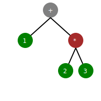

# 2. 構文解析の基本

この章からいよいよ構文解析についての説明を始めたいと思います。とはいっても本書を手に取った皆様は構文解析についてまだ馴染みがないかと思います。そこで、まずは第1章でみたような算術式の構文解析を例にして、構文解析の基本について学ぶことにしましょう。

## 2.1 算術式の文法

ただ「算術式」といっただけだと人によってかなりイメージするものが異なります。本書では以下の条件を満たすものを算術式とします。

- 四則演算が使える
  - 足し算は`x + y`
  - 引き算は`x - y`
  - 掛け算は`x * y`
  - 割り算は`x / y`
- 優先順位は掛け算・割り算が高く、足し算・引き算が低い
  - たとえば、`1 + 2 * 3`は`1 + (2 * 3)`と解釈される
- 同じ優先順位の演算子は左から右に結びつく
  - たとえば、`1 + 2 - 3`は`(1 + 2) - 3`と解釈される
- 値は整数のみ
  - たとえば、`1 + 2.0`のような式はエラーになる
- 式の優先順位を変えるために括弧を使うことができる
  - たとえば、`(1 + 2) * 3`は`3 * 3`と解釈される
- 式の要素間にあるスペースは無視される
  - たとえば、`1+2`は`1 + 2`と同じ

この定義に従う算術式には以下のようなものが含まれます。

```text
1 + 2 * 3
(1 + 2) * 3
3 * (1 + 2)
12 / 3
1 + 3 * 4 / 2
```

普段、皆さんは何かしらのプログラミング言語を使ってプログラムを書いているはずですから、上のような算術式は馴染みが深いはずです。

しかし、上のような日本語を使った定義だけでは算術式の文法を表現するのには不十分です。たとえば「式の要素間にあるスペースは無視される」という言葉だけでは、`10`と`1 0`を区別することができません。優先順位についても感覚的にはわかるものの、やはり定義としては曖昧です。式の優先順位を変えるために括弧を使えるという表現も、直感にはあっているものの現実の文法を表現するには不十分です。

もちろん、日本語でより詳しく記述して曖昧さを少なくしていくこともできますが、いたずらに長くなるだけです。それよりも、文法を表現するための文法である形式文法を使って、算術式の文法を表現することが一般的です。形式文法というと何かしらとても難しいもののように感じられますが、実際には簡単なものです。次節では形式文法の一つであり、もっともメジャーな表記法であるBNF（Backus-Naur Form、バッカス・ナウア記法）を使って、算術式の文法を表現してみましょう。

## 2.2 算術式のBNF

プログラミング言語の文法自体を表現する文法（メタ文法といいます）の一つに、BNFがあります。BNFは、プログラミング言語の文法をはじめ、インターネット上でのメッセージ交換フォーマットなど、様々な文法を表現するのに使われています。本書の読者の方にはBNFに馴染みのない方も多いと思うので、算術式のBNFの前にBNFについて説明します。本書ではISO/IEC 14977で仕様が策定されたEBNFの事を指してBNFと呼ぶことにします。BNFは歴史的に、かなり多くの方言があり、どの記法を使うか事前に説明しておかないと読みづらいためです。

### 2.2.1 BNFの概要

BNFはFortranの開発者でもある、John Backus（ジョン・バッカス）らが開発した記法です。BNFは「プログラミング言語」そのものの文法を記述するために開発されました。基本情報技術者試験でも出題されるので、そこで知った方もおられるかもしれません。

では、早速、BNFの具体例を見て行きましょう。以下の例は2.1ででてきた算術式を元に、

- 空白を許さない
- 扱える数値は一桁だけ

のように単純化したBNFです。

```bnf
expression = term { ('+' | '-') term };
term = factor { ('*' | '/') factor };
factor = NUMBER | '(' expression ')';
NUMBER = '0' | '1' | '2' | '3' | '4' | '5' | '6' | '7' | '8' | '9';
```

たくさんの記号が出てきましたが、順番に見ていきましょう。

### 2.2.2 expression

BNFでは、以下のような**生成規則**の集まりによって、文法を表現します。

 ```
expression = term { ('+' | '-') term };
 ```

`=`の左側である`expression`が**規則名**で、右側が**本体**になります。

ここでは 

```
term { ('+' | '-' ) term }
```

が本体になります。

本体の中に出てくる、他の規則を参照する部分（ここでは`term`)を非終端記号と呼び、これは同じBNF内で定義されている規則名と一致する必要があります。

また、`'+'`や`'-'`のように`'`で囲まれた記号や文字を**終端記号**と呼びます。これはそのままの文字（あるいは文字列）である必要があり、その文字自身を表します。

BNFにおいて`{}`で囲まれたものは、その中の要素が0回以上繰り返して出現することを示しています。`term { ('+' | '-') term }`は、`term`が`+`または`-`を挟んで1回以上繰り返して出現することを示しています。
  
この規則を日本語で表現すると「`expression`という名前の規則は、右辺`term { ('+' | '-') term }`を参照している」と読むことができます。

### 2.2.3 term

`term` は算術式の中で、掛け算や割り算を表す規則です。`factor`という規則を参照しています。

```bnf
term = factor { ('*' | '/') factor };
```

この規則によって`term`は、`factor`が`*`または`/`を挟んで1回以上繰り返して出現することを示しています

### 2.2.4 factor

`factor`は算術式の中で、数値や括弧で囲まれた式を表す規則です。

```bnf
factor = NUMBER | '(' expression ')';
```

これによって`factor`は、`NUMBER`または`(`で始まって`)`で終わることを示しています。

### 2.2.5 NUMBER

`NUMBER`は数値を表す規則です。

```bnf
// 数値は1桁の整数に限定
NUMBER = '0' | '1' | '2' | '3' | '4' | '5' | '6' | '7' | '8' | '9';
```

これは`0`から`9`のどれか1文字であることを示しています。

## 2.3 BNFを使った解析プロセス

算術式の文法をBNFで表現することができました。さて、このBNFの規則`expression`を使うと、式`1+2`はどのように解析できるのでしょうか？ここでは、その概要について簡単に説明します。

ここで、BNFの各規則は関数であり、BNFの各規則は関数であり、規則の名前が関数名、本体が関数本体に対応すると考えます。

また、その関数の引数は解析したい文字列との添字であるものとします。たとえば、`expression("1+2", 0)`は、文字列`"1+2"`の先頭から解析を開始することを示します。

関数の呼び出し結果は、

- 解析に成功した場合：成功したことを表す定数`SUCCESS`と、まだ解析されていない残りの文字列`s`。これを`(SUCCESS, s)`と表す
- 失敗した場合：失敗を表す定数`FAIL`を返す

のどちらかであるものとします。

2. 最上位の規則`expression`を適用

まず、最上位の規則`expression`を呼び出します。これは`expression("1+2")`となります。

```bnf
expression = term { (`+` | `-`) term }
```

規則の本体では`term`が最初に出現するので、規則`term`を適用します。つまり、`term("1+2")`となります。

3. 規則`term`を適用

規則`term`は以下のようになっています。

```bnf
term = factor { (`*` | `/` ) factor }
```

`term`の本体では`factor`が最初に出現するので、規則`factor`を適用します。つまり、`factor("1+2")`となります。

4. 規則`factor`を適用

規則`factor`は以下のようになっています。

```bnf
factor = NUMBER | '(' expression ')'
```

`term`の本体は`NUMBER`か`'(' expression ')'`のどちらかですが、`"1+2"`の先頭は`NUMBER`になります。したがって、`NUMBER`を適用します。これは`NUMBER("1+2")`となります。

5. 規則`NUMBER`を適用

規則`NUMBER`は以下のようになっています。

```bnf
NUMBER = '0' | '1' | '2' | '3' | '4' | '5' | '6' | '7' | '8' | '9'
```

今、文字列の0番目と規則を照合しようとしているわけですが、`"1+2"`の0番目の文字は`1`です。したがって、`NUMBER`の本体の内、`1`との照合に成功します。

この結果、`NUMBER`の解析は成功し、残りの解析すべき文字列は`"+2"`になります。これを`(SUCCESS, "+2")`と表すことができます。

また、解析が成功したので、`NUMBER`の呼び出しから戻ります。

6. 規則`term`の解析を続行

`NUMBER`から戻ってきた先は、規則`factor`の中で、`factor`の「次」です。↑で現在照合を進めている場所を表すとしたら、次のようになります。

```bnf
term = factor ↑ { (`*` | `/` ) factor }
```

次に、`term`の本体の中で残りの式である

```text
{ (`*` | `/` ) factor }
```

を照合します。今、残りの文字列は`"+2"`なので、`*`や`/`との照合に失敗します。つまり、`factor`の呼び出しは失敗し、値は`FAIL`となります。

しかし、`{}`で囲まれた部分は0回以上繰り返して出現することを示しているので、`factor`の解析は失敗しても、

```text
{ (`*` | `/` ) factor }
```

の解析自体は成功します。この場合、**1文字も進まずに**成功するので、値としては`(SUCCESS, "+2")`となります。

最初の`factor`の呼び出しは既に成功しているので、規則全体の呼び出しが成功し、`term`の呼び出しから戻ります。

7. 規則`expression`の解析を続行

`term`の呼び出しから戻ってきた先は、規則`expression`の中で、↑で示されている位置です。

```bnf
expression = term ↑ { (`+` | `-`) term }
```

`expression`の本体の中で残りの式である

```text
{ (`+` | `-`) term }
```

を解析する必要があります。残りの文字列は`"+2"`なので、`+`または`-`との照合に成功します。つまり、`('+' | '-')`は成功し、`term`の解析に移ります。

8. 規則`term`を再び呼び出す

一見先程と同じことをしているように見えますが、既に2文字分進んでいることに注意してください。つまり、`term("2")`となります。

そこからは先程と同様に、規則の再帰的な呼び出しを経て、最終的に`NUMBER("2")`で`NUMBER`の解析が成功し、`(SUCCESS, "")`となります。

9. 規則`expression`の解析を続行

`term`の呼び出しから戻ってきた先は、規則`expression`の中で、↑で示されている位置です。

```bnf
expression = term { (`+` | `-`) term ↑ }
```

`{}`で囲まれた部分は0回以上の繰り返しですから、次のようにして解析を続行します。

```bnf
expression = term { ↑ (`+` | `-`) term ↑ }
```

しかし、残りの文字列はもう何もないので、`expression`の解析は成功し、`(SUCCESS, "")`となります。

これが最終結果になるので、規則`expression`と文字列`1+2`は一致することがわかりました。

### 2.4 BNFと解析結果

このようにして、算術式の文法をBNFで表現し、実際に算術式をあらわす文字列と照合することができました。

しかし、これでは文字列が与えられたBNFにマッチするかどうかの判定しかできません。

皆さんおなじみのJSONがそうであるように、実用的には解析した結果を何らかのデータ構造に変換して格納しておく必要があります。

次の節では、BNFで表現された算術式を解析し、その結果を抽象構文木というデータ構造に変換する方法について説明します。

## 2.3 抽象構文木

抽象構文木とは何でしょうか？今、私達が欲しいのは

- 空白や括弧といった余分な情報が含まれず
- 演算子の優先順位を表現できる

ような構造です。**抽象構文木**（Abstract Syntax Tree）は、そのようなニーズを満たすデータ構造です。

抽象構文木は一般には任意個の個を持つ多分木として表現されます。

たとえば、`1 + 2 * 3`という算術式の抽象構文木は以下のようになります。



抽象構文木の各ノードは、プログラムの構造を表現するためのデータ構造です。たとえば、`+`ノードは足し算を表し、`1`ノードは整数の`1`を表します。

### 2.3.1 抽象構文木の構造

ここでは抽象構文木の構造について見ていきましょう。抽象構文木（AST）では、各ノードはプログラムの構成要素を表し、親子関係によって演算子とオペランドの関係性を示します。抽象構文木には次のようなノードがあります。

### 2.3.2 内部ノード

演算子や制御構造など、他のノードを子として持つノードです。

先程の例でいうと、`+`ノードと`*`ノードが内部ノードです。

### 2.3.3 葉ノード

子を持たないノードです。例えば、`1`や`2`、`3`といった数値は葉ノードとなります。

一般的には、リテラルや変数など、それ以上分解できない最小単位のノードが葉ノードとなります。

### 2.3.4 根ノード

抽象構文木の最上位に位置するノードです。抽象構文木の根となるノードであり、プログラム全体を表します。数式の例でいえば、全体を表す`+`ノードが根ノードとなります。

内部ノードと根ノードは排他でないことに注意してください。たとえば、`+`ノードは内部ノードであり、同時に根ノードでもあります。

### 2.3.5 優先順位

改めて、先程の抽象構文木を見てみましょう。


この木構造では、`+`がルートノードであり、その左の子が`1`、右の子が`*`です。`*`ノードの子として`2`と`3`が配置されています。これにより、演算の優先順位が明確に表現されるわけです。

直感的にも、この抽象構文木に対して`(1 + 2) * 3`のような解釈をすることが無理なことはわかりやすいと思います。 

### 2.3.6 抽象構文木をJavaで表現する

抽象構文木は視覚的な表現としても便利ですが、その真価はプログラム上で表現・処理することにあります。ここではJavaで表現する方法を紹介します。

```java
// 式を表すインタフェース
sealed interface Expression permits Addition, Subtraction, Multiplication, Division, NumberT {}
// 加算を表すレコード
record Addition(Expression left, Expression right) implements Expression {}
// 減算を表すレコード
record Subtraction(Expression left, Expression right) implements Expression {}
// 乗算を表すレコード
record Multiplication(Expression left, Expression right) implements Expression {}
// 除算を表すレコード
record Division(Expression left, Expression right) implements Expression {}
// 数値を表すレコード
// Numberはjava.lang.Numberと名前が被るのでNumberTにしてある
record NumberT(int value) implements Expression {}
```

インタフェース`Expression`は、抽象構文木のノードを表すインタフェースです。

`Addition`、`Subtraction`、`Multiplication`、`Division`、`NumberT`は、それぞれ加算、減算、乗算、除算、数値を表すレコードです。これによって、抽象構文木をJavaで表現することができます。

試しに`1 + 2 * 3`の抽象構文木をJavaで表現してみましょう。

```java
Expression ast = new Addition(
  new NumberT(1),
  new Multiplication(
    new NumberT(2),
    new NumberT(3)
  )
);
```

各レコードクラスのインスタンスを作成することで、抽象構文木を表現することができます。

### 2.3.7 抽象構文木を評価する

抽象構文木を作成するだけでは、プログラムの実行結果を得ることはできません。抽象構文木を評価するためには、再帰的な処理を行うことが必要です。抽象構文木を辿りながら、各ノードの演算を行うことで、プログラムの実行結果を得ることができます。

以下は、算術式の抽象構文木を評価するJavaのコード例です。

```java
int eval(Expression e) {
  switch(e){
    case NumberT n:
      return n.value();
    case Addition a:
      return eval(a.left()) + eval(a.right());
    case Subtraction s:
      return eval(s.left()) - eval(s.right());
    case Multiplication m:
      return eval(m.left()) * eval(m.right());
    case Division d ->
      if(eval(d.right()) == 0) {
        throw new ArithmeticException("division by zero");
      }
      return eval(d.left()) / eval(d.right());
  };
}
```

ノードの種類に応じてswitch式で処理を分岐しています。`NumberT`ノードの場合はその値を返し、`Addition`ノードの場合は左右の子ノードを再帰的に評価して足し算を行います。同様に、`Subtraction`、`Multiplication`、`Division`ノードの場合も、それぞれの演算を行っています。

このように、抽象構文木をデータとして表現することで、プログラムの構造を簡単に解析することができるのです。

## 2.4 まとめ

この章では、算術式の文法を例題としてBNFについて紹介し、BNFに基づいて算術式を解析する方法の概要について説明しました。また、抽象構文木についても紹介し、抽象構文木をJavaで表現する方法と、抽象構文木を評価する方法について説明しました。

しかし、今のままではBNFと抽象構文木を繋ぐことができません。次章では、BNFを元に、実際にJavaで動くJSONの構文解析器を実装し、JSONの抽象構文木を生成する方法について詳しく説明します。